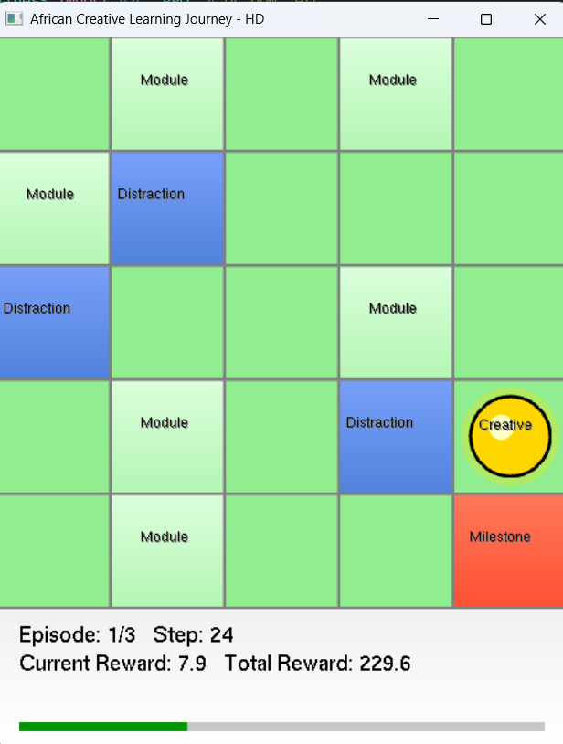

# Creative Learning Path - RL Grid Environment

Welcome to my Reinforcement Learning project!  
This repository contains my ALU Machine Learning Techniques II summative assignment, where I designed, trained, and visualized agents navigating a custom grid world.

---

## Demo Video

[Watch the simulation in action here!](https://youtu.be/sAgsZt0HxjU)

---

## Project Overview

This project simulates a digital learning journey for young African creatives. The agent, representing a learner, must navigate a 5x5 grid—making choices to avoid distractions and reach key milestones as efficiently as possible.

- **Grid tiles:** Modules, Distractions (obstacles), and a Milestone (goal)
- **Agent:** Chooses moves (up, down, left, right), with each step penalized and rewards for reaching milestones quickly

---

## Environment Visualization



The grid environment is rendered in real time using OpenGL.  
Key features:
- **🟨 Agent ("Creative")** — shows current agent location
- **🟦 Distractions** — obstacles to avoid
- **🟩 Modules** — regular learning tiles
- **🟥 Milestone** — the goal tile

A progress bar at the bottom displays steps and cumulative reward per episode.

---

## Algorithms Used

The following RL methods were implemented and compared:
- **Deep Q-Network (DQN)** with experience replay and target networks
- **Proximal Policy Optimization (PPO)** using Stable-Baselines3
- **Advantage Actor-Critic (A2C)**
- **REINFORCE** (custom implementation in PyTorch)

Each was trained on the environment to maximize cumulative reward by reaching milestones efficiently.

---

##  Results & Insights

- **PPO** achieved the best performance, with the highest average reward and fastest convergence.
- **DQN** performed well but was more sensitive to hyperparameter tuning.
- **A2C** balanced speed and stability, but was less robust than PPO.
- **REINFORCE** learned more slowly and showed higher variance, as expected for a pure policy gradient method.

Key insights:
- Hyperparameter tuning (especially learning rate and exploration) was crucial.
- OpenGL visualization made it easy to spot agent behaviors, policy failures, and successful paths.

---

##  How to Run

1. **Install requirements:**
   ```bash
   pip install -r requirements.txt
   ```

2. **Train an agent (optional):**
- Use scripts in `training/` to train DQN, PPO, A2C, or REINFORCE agents.
- Trained models are saved in the `models/` directory.

3. **Visualize an agent:**
   ```bash
   python main.py
   ```

- The OpenGL window will show the agent moving in the grid.
- To visualize a trained agent, ensure `main.py` loads the model.

---

## Project Structure

- `environment/custom_env.py` — Grid environment
- `environment/rendering.py` — OpenGL visualization
- `training/` — RL training scripts
- `models/` — Saved models
- `main.py` — Run visualization/demo

---

## Why OpenGL?

Switching from Pygame to OpenGL provided smoother rendering, hardware acceleration, and made the project extensible for future visual improvements (e.g., 3D, animation, shadows).

---

## License

Educational use for ALU.  
If you reuse, please cite or credit appropriately.

---

*For detailed results, graphs, and further discussion, please see my full [assignment report](https://github.com/maxprodigy/Peter_Johnson_rl_summative/blob/main/environment/%5BPeter%20Johnson%5D%20Machine_Learning_Techniques_II%20-%20Summative_Assignment%20-%20Report.pdf).*

---
